\newpage

# Supplementary Note S1: compute infrastructure

**ESM-2 embeddings (HPC).** The embeddings came off CSUC's Pirineus3 cluster, scheduled through Slurm onto its NVIDIA H100 cards. Setting up there was not trivial. Its shared environment is read-only and PyTorch is not installed, so I had to build a conda environment of my own — torch 2.6 on CUDA 12.4, transformers 5.9 — pulling the packages through the site proxy. I also prefetched the model weights into a local cache, so the compute nodes never touch the network. A resumable, memory-mapped, half-precision script mean-pools the last hidden state for every family. The 35M model embedded all 1,447,952 families in 1 hour 18 minutes (about 317 sequences/s) and the 650M model in 4 hours 32 minutes (about 89 sequences/s), giving a 7.4 GB embedding matrix. Rather than move that matrix around, I train the sequence and fusion models on the cluster GPU (precomputing the abundance scores locally and shipping them as a small file) and only copy the small result tables back.

**Local environment.** Everything else — the sample-level classifiers, the abundance models — I ran on a laptop, under conda with Python 3.12, PyTorch on the Apple-Silicon MPS backend, scikit-learn, pandas and pyarrow.

\newpage

# Supplementary Tables

: Table S1 — Trainable model architectures and parameter counts.

| Experiment | Model | Architecture (layer widths) | Trainable parameters |
|---|---|---|---|
| Phenotype | Autoencoder (pathways) + LR head | 466-256-64-**32**-64-256-466 | 276,594 (+33) |
| Phenotype | Autoencoder (species) + LR head | 572-256-64-**32**-64-256-572 | 330,972 (+33) |
| Prioritization | Linear (abundance) | 1595-1 | 1,596 |
| Prioritization | **MLP (abundance)** | 1595-256-64-1 | **425,089** |
| Sequence/fusion | SeqMLP (k-mer) | 400-256-64-1 | 119,169 |
| Sequence/fusion | SeqMLP (ESM-2 35M) | 480-256-64-1 | 139,649 |
| Sequence/fusion | **SeqMLP (ESM-2 650M)** | 1280-256-64-1 | **344,449** |
| Sequence/fusion | Fusion (logistic) | 2-1 | 3 |

: Table S2 — All rankers on the protein-family prioritization test set (217,193 families, 1.87 % base rate). Relates to Section 4.2.

| Method | AUPRC | AUROC | P@1000 | enrichment@1000 |
|---|---|---|---|---|
| Random | 0.018 | 0.497 | 0.012 | 0.6× |
| Ecology score | 0.075 | 0.746 | 0.210 | 11.2× |
| MetaWIBELE supervised (published) | 0.064 | 0.703 | 0.198 | 10.6× |
| **MetaWIBELE unsupervised (published)** | **0.076** | 0.730 | 0.212 | 11.4× |
| Linear (ours) | 0.104 | 0.797 | 0.264 | 14.1× |
| **MLP (ours)** | **0.142** | **0.832** | **0.339** | **18.2×** |

: Table S3 — AUPRC by characterization category, abundance models. Relates to Section 4.3.

| Bucket | n | positives | base rate | MetaWIBELE unsup | MetaWIBELE sup | **MLP (ours)** |
|---|---|---|---|---|---|---|
| characterized | 125,750 | 3,302 | 0.026 | 0.096 | 0.079 | **0.167** |
| weak homology | 67,135 | 703 | 0.011 | 0.024 | 0.023 | **0.059** |
| novel (no homology) | 24,308 | 50 | 0.002 | 0.003 | 0.003 | **0.005** |

: Table S4 — Sequence and fusion models (test set: 217,193 families, base rate 1.87 %). Relates to Section 5.2.

| Method | AUPRC | AUROC | P@1000 | enrichment@1000 |
|---|---|---|---|---|
| MetaWIBELE supervised | 0.064 | 0.703 | 0.198 | 10.6× |
| MetaWIBELE unsupervised | 0.076 | 0.730 | 0.212 | 11.4× |
| Abundance (MLP) | 0.142 | 0.832 | 0.339 | 18.2× |
| Sequence-only (k-mer) | 0.182 | 0.875 | 0.351 | 18.8× |
| Sequence-only (ESM-2 35M) | 0.241 | 0.902 | 0.452 | 24.2× |
| **Sequence-only (ESM-2 650M)** | **0.271** | **0.910** | 0.481 | 25.8× |
| Fusion (abundance + k-mer) | 0.307 | 0.911 | 0.583 | 31.2× |
| **Fusion (abundance + ESM-2 650M)** | **0.368** | **0.927** | **0.631** | **33.8×** |

: Table S5 — Multi-seed test AUPRC (mean ± 95 % CI over 5 splits; ESM-2 35M pipeline). Relates to Section 5.5.

| Method | mean AUPRC | 95% CI |
|---|---|---|
| MetaWIBELE supervised | 0.067 | [0.065, 0.069] |
| MetaWIBELE unsupervised | 0.078 | [0.075, 0.081] |
| Abundance MLP | 0.140 | [0.137, 0.144] |
| Sequence-only (ESM-2 35M) | 0.227 | [0.223, 0.231] |
| **Fusion (abundance + ESM-2 35M)** | **0.348** | **[0.341, 0.356]** |

: Table S6 — AUPRC by characterization category (ESM-2 650M test predictions). Relates to Section 5.6.

| Bucket | n | pos | base rate | MetaWIBELE unsup | Abundance MLP | Sequence ESM-2 650M | Fusion |
|---|---|---|---|---|---|---|---|
| characterized | 125,750 | 3,302 | 0.026 | 0.096 | 0.167 | 0.301 | **0.403** |
| weak homology | 67,135 | 703 | 0.011 | 0.024 | 0.059 | 0.184 | **0.212** |
| novel (no homology) | 24,308 | 50 | 0.002 | 0.003 | 0.005 | 0.074 | **0.091** |

: Table S7 — Pfam domains most enriched in the top-1000 ranked families. Relates to Section 5.8.

| Pfam | Domain | top / bg count | odds ratio | FDR |
|---|---|---|---|---|
| PF07715 | TonB-dependent receptor, plug | 49 / 851 | 13.0 | $2\times10^{-33}$ |
| PF00593 | TonB-dependent receptor, barrel | 44 / 665 | 14.9 | $2\times10^{-32}$ |
| PF14322 | SusD-like, glycan binding | 36 / 505 | 16.0 | $9\times10^{-28}$ |
| PF07980 | SusD family | 36 / 518 | 15.5 | $2\times10^{-27}$ |
| PF02915 | Rubrerythrin (oxidative stress) | 12 / 65 | 40.4 | $8\times10^{-14}$ |

: Table S8 — Bootstrap 95 % confidence intervals on the 650M test set ($B=1000$ resamples). Primary metric in bold. Relates to Section 5.9.

| Method | **AUPRC** [95 % CI] | AUROC [95 % CI] |
|---|---|---|
| MetaWIBELE unsupervised | **0.075** [0.070, 0.082] | 0.730 [0.720, 0.739] |
| MetaWIBELE supervised | **0.064** [0.059, 0.070] | 0.703 [0.694, 0.712] |
| Abundance MLP | **0.142** [0.133, 0.152] | 0.831 [0.825, 0.838] |
| Sequence ESM-2 650M | **0.271** [0.257, 0.286] | 0.910 [0.905, 0.914] |
| Fusion (abundance + ESM-2) | **0.368** [0.353, 0.385] | 0.927 [0.923, 0.931] |

: Table S9 — The leakage trap (ElasticNet, HMP2 species, IBD vs control). Relates to Section 6.2.

| Evaluation | AUROC |
|---|---|
| HMP2 naive sample-level 5-fold CV (leaky) | 0.948 |
| HMP2 participant-grouped 5-fold CV (correct) | 0.460 |

: Table S10 — EC-enzyme cross-cohort transfer, AUROC (2,052 shared EC numbers). Relates to Section 6.5.

| Model | within-cohort CV | HMP2 → Franzosa | Franzosa → HMP2 |
|---|---|---|---|
| ElasticNet | 0.905 | 0.704 | 0.690 |
| PCA32 + LR | 0.901 | 0.704 | 0.667 |
| **Autoencoder32 + LR** | 0.908 | **0.738** | 0.653 |
| VAE32 + LR | 0.867 | 0.687 | 0.629 |

: Table S11 — PCA of the pooled cohorts (197 shared species) and how separable each structure is along the first ten components. Relates to Section 6.7.

| Quantity | Value |
|---|---|
| PC1 variance explained | 8.9 % |
| PC2 variance explained | 5.8 % |
| 10-PC logistic AUROC, cohort (batch) | 0.99 |
| 10-PC logistic AUROC, diagnosis (biology) | 0.66 |

\newpage

# Supplementary Figures

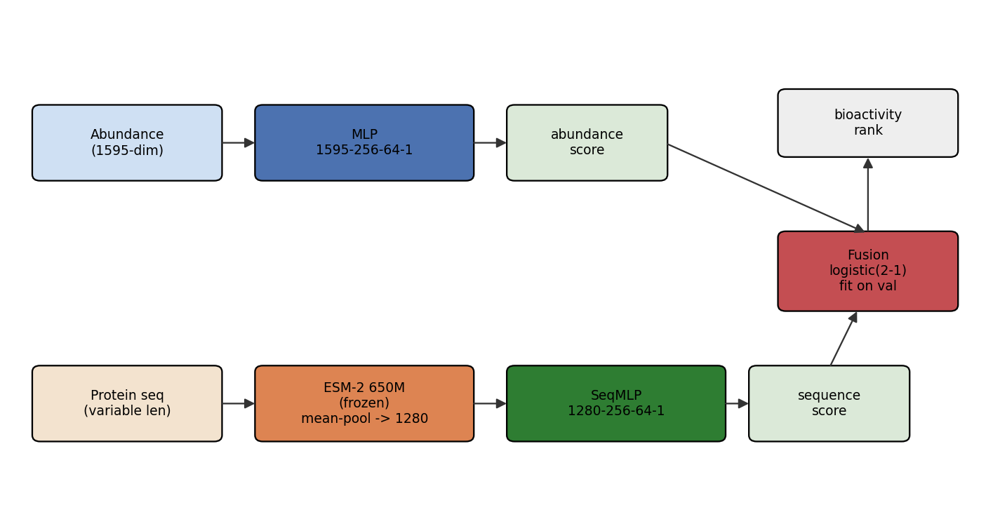{width=82%}

{width=88%}

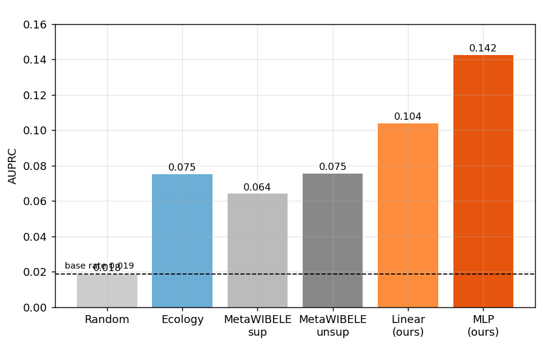{width=78%}

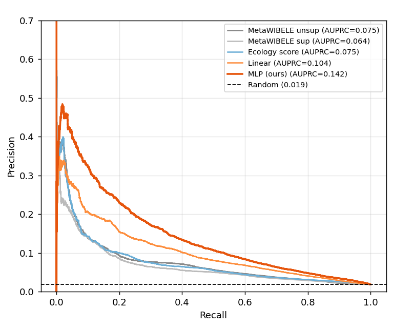{width=72%}

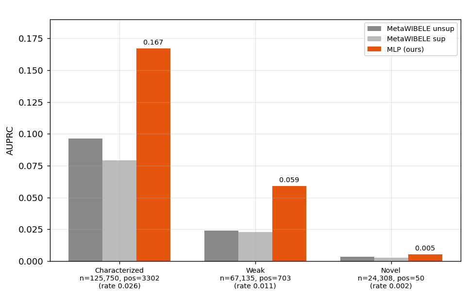{width=82%}

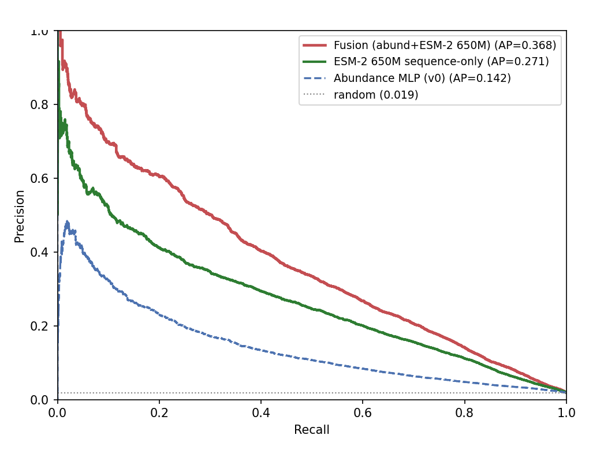{width=72%}

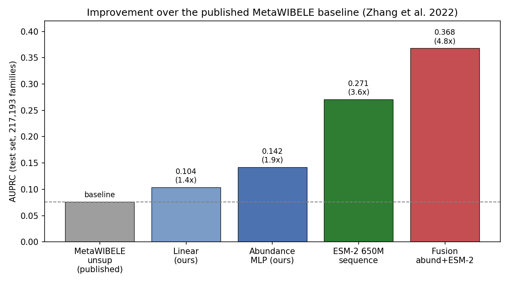{width=78%}

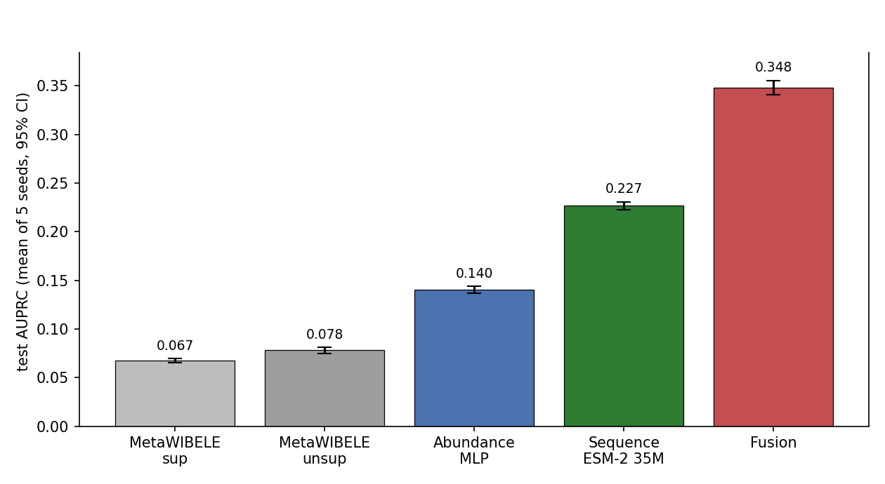{width=78%}

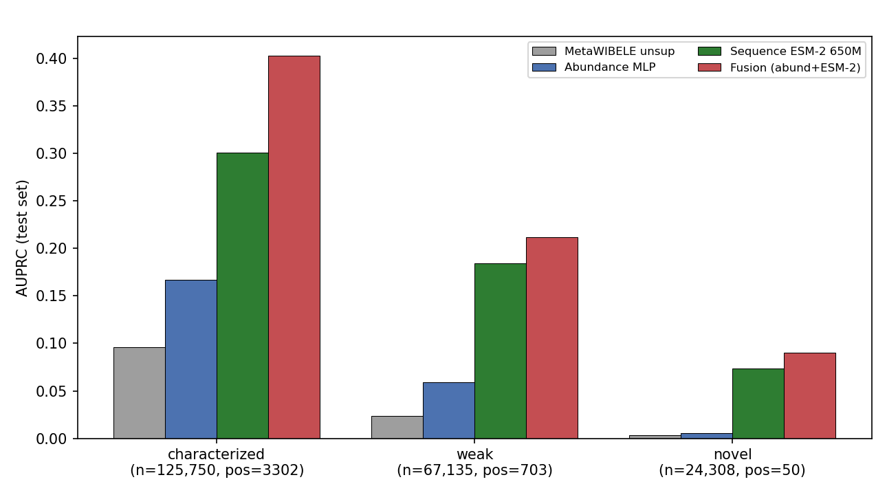{width=82%}

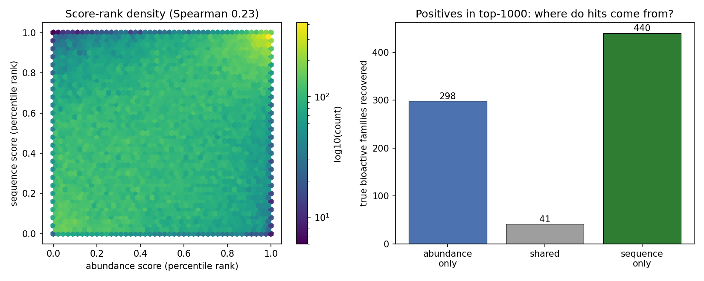{width=92%}

{width=92%}

{width=78%}

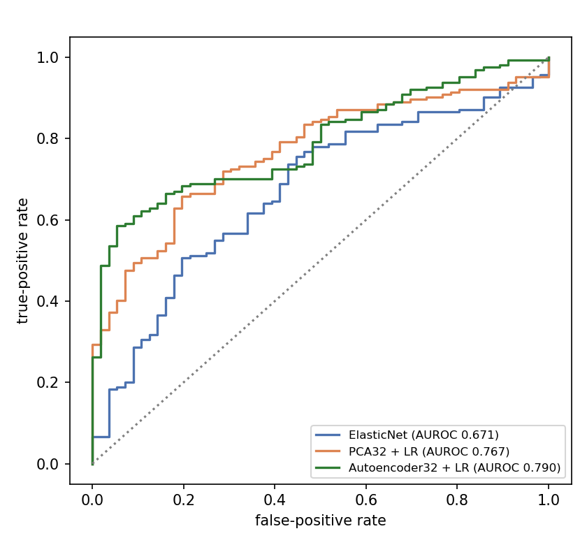{width=60%}

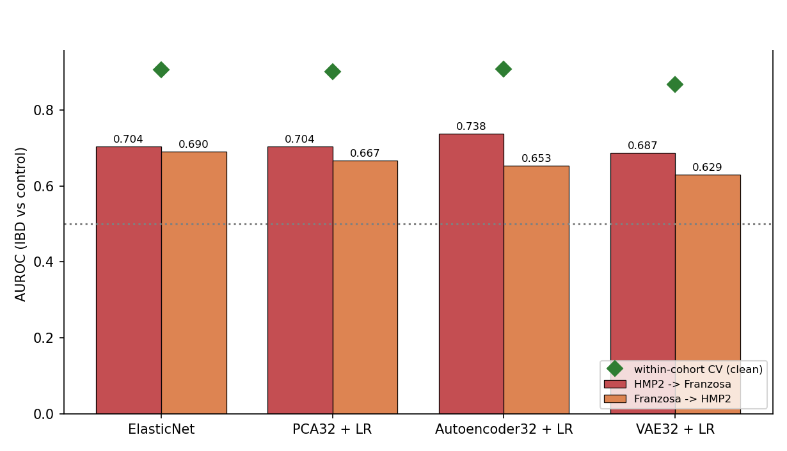{width=76%}

{width=95%}
