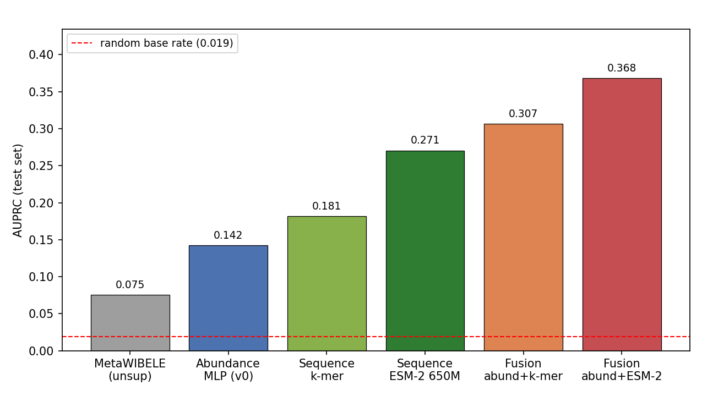

# Abstract

High-throughput assays routinely measure far more features than samples, and their analysis still rests largely on classical linear tools: penalised regression, principal component analysis feeding a linear classifier, fixed signature scores. These are interpretable and reliable, but they assume broadly linear structure and frequently lose accuracy once moved to another cohort or batch. Deep networks offer an alternative, learning a compact non-linear representation that can then be reused for a downstream task. Whether that helps in practice, and under which conditions, is the question this thesis addresses on a published benchmark: the gut microbiome in inflammatory bowel disease characterised by Zhang et al. (2022), whose MetaWIBELE method supplies the baseline to beat.

Four experiments follow. On sample-level dysbiosis classification the classical models prove hard to surpass — ElasticNet on functional profiles reaches a test AUROC of 0.940 and a small autoencoder does not improve on it — a negative result I keep because it marks where deep methods do not yet pay. Ranking potentially bioactive protein families is the principal experiment. Across 1.45 million families, of which 27,034 are detected by metaproteomics, a small multilayer perceptron on abundance profiles reaches a test AUPRC of **0.142** against **0.076** for the published MetaWIBELE priority evaluated on the same families. Metaproteomic detection evidences expression rather than function, however, and those labels correlate with abundance, so I also rank families from sequence alone using ESM-2 650M embeddings. Sequence gives **0.271**, and fusing it with abundance gives **0.368** — 4.8 times the published score, with 86 % precision among the top 100. The two scores correlate at only 0.23, which is why fusion pays. Transferring an IBD-versus-control model from HMP2 to the independent PRISM cohort, finally, the learned representation wins outright at a cross-cohort AUROC of **0.790** against **0.671** for ElasticNet, although naive cross-validation on the longitudinal cohort first reported 0.95 for a task that falls to 0.46 once whole patients are held out. Headline comparisons carry bootstrap or multi-seed confidence intervals. Read together, these results locate the benefit of deep representation learning in particular regimes: high feature dimensionality, complementary signals available to fuse, and training data sufficient to estimate the representation.

# 1. Introduction

## 1.1 Biological background

This thesis belongs to omics data analysis, and much of its readership will come from computing rather than biology. This section therefore establishes the biological concepts on which the later sections depend.

Several hundred bacterial species inhabit the adult intestinal tract, alongside archaea, fungi and viruses, and between them they carry many times the gene content of the human genome. Position, more than number, accounts for the importance of this **gut microbiome**: the community lies against the intestinal wall and metabolises whatever reaches the colon, and in doing so participates in digestion, in immune maturation, and in maintaining the mucus layer that separates the two.

**Inflammatory bowel disease** (IBD) is chronic gut inflammation that relapses. Clinical practice recognises two forms, distinguished by where the inflammation sits and how deep it runs. Crohn's disease (CD) may appear anywhere from mouth to anus and involves the full thickness of the wall; ulcerative colitis (UC) is restricted to the colon and to its mucosal surface. No single cause has been established for either. The accepted model is interactive: susceptibility genes, environmental exposure and a shifted microbiome combine until the immune response turns against tissue it should leave intact. HMP2 designates its comparison group non-IBD controls, and these were not healthy volunteers: they presented with comparable symptoms and received no IBD diagnosis.

**Dysbiosis** requires particular care. The term denotes a microbiome that has departed from the configuration typical of healthy individuals, generally toward reduced diversity, with obligate anaerobes displaced by facultative ones. Two consequences follow. The label derives from the microbiome and not from the patient: HMP2 designates a sample dysbiotic once its taxonomic profile exceeds a fixed distance from the median non-IBD profile. Dysbiosis is therefore **not** equivalent to an IBD diagnosis. Patients remain non-dysbiotic much of the time, and control samples occasionally cross the threshold. Section 3 predicts this label, so its results concern whether a community is currently disturbed rather than whether a donor is ill; the diagnostic question is addressed in Section 6. The two should not be treated as interchangeable.

A stool sample admits more than one summary, and Section 3 turns on the distinction. **Shotgun metagenomics** sequences all DNA present, from which two representations can be constructed. A **taxonomic** profile records which organisms are present and in what proportion — *who is there*. A **functional** profile records the abundance of metabolic pathways or enzyme families — *what the community can collectively do*. The two diverge more often than might be expected, since a given pathway is frequently carried by otherwise unrelated species, so that two individuals with dissimilar taxonomic profiles may be functionally comparable. Both representations are therefore compared rather than one being selected in advance.

A final distinction constrains Sections 4 and 5. DNA establishes that a gene is present, but not that anything was translated from it. **Metaproteomics** (MPX) is a separate measurement: peptides are extracted from stool and identified by mass spectrometry, so a positive result indicates that the protein was translated and present in detectable quantity. Every positive label in the protein-ranking experiments is a family detected in this way. Detection evidences expression; it does not evidence function, a limitation returned to in Section 7.

## 1.2 Hypothesis

A representation learned from high-dimensional omics data should be competitive with the linear, signature-based methods that dominate current practice. The hypothesis tested here is that it can match or exceed them on three axes: predictive performance, robustness, and generalisation across cohorts.

## 1.3 Benchmark and data

I use the HMP2 / IBDMDB cohort: 1,595 stool metagenomes from 130 individuals (Crohn's disease, ulcerative colitis, and non-IBD controls), sampled over roughly one year. The processed profiles were downloaded from the IBDMDB portal (<https://ibdmdb.org/>) in May 2026: `taxonomic_profiles.tsv.gz` (MetaPhlAn), `pathabundance_relab.tsv.gz` and `ecs_relab.tsv.gz` (HUMAnN), together with `hmp2_metadata.csv` and the `dysbiosis_scores` table. Only metagenomic (MGX) rows are retained; from the taxonomic file I keep species-level rows and drop the strain level, and from the HUMAnN files I keep community-level rows and drop the species-stratified ones. That yields the 572 species and 466 pathways used in Section 3, and the 2,052 shared EC numbers used in Section 6.5. This is the cohort behind Zhang et al., *Discovery of bioactive microbial gene products in inflammatory bowel disease*, Nature **606**, 754–760 (2022), whose **MetaWIBELE** workflow produces published priority scores for about 1.4 million microbial protein families. MetaWIBELE is a good baseline to measure against, because it is strong, transparent, and runs on exactly the same data and labels I use.

The benchmark supports two kinds of prediction. The first is sample-level phenotype classification (dysbiotic vs non-dysbiotic). The second, and the main focus of this thesis, is ranking individual protein families by how likely they are to be potentially bioactive in IBD. Because the positive labels come from metaproteomic detection, that ranking says which families are plausible candidates; it does not establish that any of them is active.

## 1.4 Related work

**Machine learning on metagenomes.** Predicting host phenotype from whole-metagenome profiles is, by now, routine. Pasolli et al. (2016), in the MetAML benchmark, put random forests, support-vector machines, and penalised linear models head to head on many disease datasets. Two approaches stood out as hard to displace: tree ensembles and elastic-net regression. The curatedMetagenomicData resource (Pasolli et al. 2017) subsequently made such cross-study comparisons straightforward. Deep learning arrived a little later — through DeepMicro (Oh & Zhang 2020), where autoencoder embeddings of abundance profiles matched or exceeded classical models on several cohorts, and through phylogeny-aware convolutional networks (Fioravanti et al. 2018). The picture that emerges is genuinely mixed: deep models help on some datasets and not on others. Pinning down that regime, rather than assuming it, is the task this thesis sets itself.

**Representation learning.** The unsupervised encoders examined in this thesis are the autoencoder (Hinton & Salakhutdinov 2006), its denoising variant (Vincent et al. 2008), and the variational autoencoder (Kingma & Welling 2014). For the classical baselines, principal component analysis (Jolliffe & Cadima 2016) provides the linear dimensionality-reduction reference and elastic-net logistic regression (Zou & Hastie 2005) the penalised-linear comparison. The networks are regularised with dropout (Srivastava et al. 2014) and trained with the Adam optimiser (Kingma & Ba 2015). For the ordination in Section 6.7, principal component analysis is preferred to t-SNE (van der Maaten & Hinton 2008) or UMAP (McInnes et al. 2018) for two reasons: its axes carry an interpretable explained-variance, and its projection coincides with the linear map used by the PCA classifier, whereas the non-linear embeddings satisfy neither requirement.

**Protein language models.** Self-supervised transformers trained on hundreds of millions of sequences, such as ESM-1b (Rives et al. 2021), ESM-2 (Lin et al. 2023) and ProtTrans (Elnaggar et al. 2022), produce per-residue embeddings that encode structural and functional properties and now underpin end-to-end structure prediction (Jumper et al. 2021). I use ESM-2 as a frozen feature extractor. This is the cheapest way to bring the signal into a ranking model without the cost of fine-tuning.

**Gut microbiome and IBD.** The recurring IBD signature is reduced diversity, blooms of *Ruminococcus gnavus* and Enterobacteriaceae, and loss of short-chain-fatty-acid producers such as *Faecalibacterium prausnitzii* (Gevers et al. 2014; Sokol et al. 2008; Lloyd-Price et al. 2019; Franzosa et al. 2019); a specific *R. gnavus* clade was later linked to Crohn's flares (Hall et al. 2017). The benchmark itself is MetaWIBELE (Zhang et al. 2022). Taxonomic and functional profiles are built with bioBakery (MetaPhlAn, HUMAnN; Beghini et al. 2021), differential abundance with MaAsLin2 (Mallick et al. 2021), protein domains from Pfam and InterPro (Mistry et al. 2021; Jones et al. 2014), subcellular localization with PSORTb (Yu et al. 2010), and families are defined over UniRef clusters (Suzek et al. 2015).

**Evaluating imbalanced rankers.** The positive label is rare, which shapes how I evaluate. Precision–recall takes priority over ROC here, since Saito & Rehmsmeier (2015) show that PR curves are the more informative summary under heavy class imbalance. Remaining uncertainty is then quantified with the non-parametric bootstrap (Efron & Tibshirani 1993).

## 1.5 Objectives

1. Build and train a family of unsupervised encoders on high-dimensional omics data: an autoencoder, a denoising autoencoder, and a variational autoencoder. (Contrastive and masked-feature encoders are natural extensions of the same design, but they were not implemented in this work and are listed as future work in Section 7.5.)
2. Apply the resulting representations to two downstream tasks, sample classification and per-feature ranking, and benchmark them against classical baselines: penalised regression, PCA with a linear classifier, and published literature scores.
3. Measure, for each method: accuracy on held-out data; behaviour under noisy or missing inputs; and generalization to a different cohort or batch.
4. State in which regimes deep methods are preferable to classical ones, and in which they are not.

# 2. Materials and methods

Implementation rests on PyTorch and scikit-learn. Most of the work — the sample-level classifiers and the abundance models — runs on a laptop using Apple-Silicon GPU acceleration (MPS), whereas the ESM-2 embeddings of Section 5 required the CSUC HPC cluster and its NVIDIA H100 cards. The code is kept in versioned Jupyter notebooks and scripts with fixed random seeds; Section "Data, code and supplementary material" states what that does and does not guarantee. Each number in this document is read straight from those notebooks rather than transcribed by hand.

## 2.1 Evaluation and comparison metrics

Both prediction problems are class-imbalanced, and the protein-family prioritization severely so (a 1.87 % positive rate), so a single metric is not enough. I report the following throughout and say which one is the primary metric in each case.

- **AUROC** is the area under the ROC curve, plotting the true-positive rate against the false-positive rate, and requires no decision threshold. Its weakness shows under strong imbalance: with so many true negatives, the false-positive rate barely moves, and the score ends up flattering the model. I therefore report it for completeness but treat it as secondary for the protein-family prioritization.
- **AUPRC** is the area under the precision–recall curve, i.e. average precision $\mathrm{AP}=\sum_k (R_k-R_{k-1})P_k$. Its random baseline is just the positive base rate (0.0187 here), so it reflects how well the rare positives are found. This is the primary metric for the prioritization, in line with the recommendation to prefer PR curves over ROC under heavy imbalance (Saito & Rehmsmeier 2015).
- **F1** is the harmonic mean of precision and recall at a 0.5 threshold, $F_1 = 2PR/(P+R)$. I use it for the balanced sample-level classification.
- **Precision@K** is the fraction of true positives among the top $K$ families by score, $\mathrm{P@}K = \tfrac{1}{K}\sum_{i\in \text{top-}K} y_i$. This is the number that actually matters in practice, since a wet lab can only follow up a fixed number of candidates and cares about how clean the top of the list is. I report $K=100$ and $K=1000$.
- **Enrichment@K** is Precision@K divided by the base rate, $\mathrm{enr@}K = \mathrm{P@}K / \bar{y}$, i.e. how many times better than random picking the top $K$ is.

The comparison against the original method is an evaluation of the *published* MetaWIBELE priority scores on a benchmark I reconstruct, not a reproduction of the evaluation reported by Zhang et al. (2022). I take their released scores unchanged and score them on the same families, the same labels and the same test split as my own models, then summarize the gap as a relative factor $r = \mathrm{AUPRC}_{\text{model}} / \mathrm{AUPRC}_{\text{MetaWIBELE}}$ (Section 5.4). MetaWIBELE was not designed against this endpoint and its authors report no AUPRC for it, so $r$ measures how the two rankings order my benchmark, not a deficiency the original authors would recognise. It is a like-for-like ranking comparison on a benchmark I build from the paper's own metaproteomics-validated positives (Tables S7 and S8 of the Zhang et al. supplement). Section 4.4 spells out where this framing has to be read with care.

## 2.2 Validation protocol

My main concern throughout is leakage. Sample-level classification is therefore split by participant rather than by sample: a single patient contributes many time points, and allowing those to fall on both sides of the split would inflate the scores. The 78/26/26 participant split corresponds to 977/343/275 samples. Protein-family prioritization uses a 70/15/15 train/validation/test partition of the 1,447,952 families, stratified on the rare positive label, which leaves 217,193 families in the test set at the true 1.87 % base rate. The abundance, sequence, and fusion experiments all reuse this same split (fixed `random_state=0`), so every comparison runs on identical test families. Standardisation is fitted on the training set alone, and the fusion calibrator of Section 5 is fitted on validation and assessed on test; at no point does test information enter a model.

## 2.3 Model architectures and parameter counts

All of the MLPs use ReLU activations. The protein-family classifiers add dropout 0.3 and a `BCEWithLogits` loss whose positive class is weighted by the negative-to-positive ratio (52.56) to offset the 1.87 % base rate; they are trained with Adam at a learning rate of $10^{-3}$, batch size 4,096, and early stopping on validation AUPRC, which halts the linear model after 6 epochs and the MLP after 8. The unsupervised encoders of Section 3 minimise mean-squared reconstruction error with Adam at $10^{-3}$, batch size 64, for 300 epochs, and the logistic head fitted on the frozen 32-dimensional code uses balanced class weights. Supplementary Table S1 gives the layer widths and exact parameter counts for every trainable network, generated by `model_cards.py`. I use the ESM-2 models as frozen feature extractors and do not fine-tune them: the 35M- and 650M-parameter backbones give per-residue hidden states, which I mean-pool to one vector per protein, and that vector is the only input to the small trainable `SeqMLP`.

For reference, the frozen sequence backbones are much larger than anything I train: ESM-2 `t12` has about 33.5 M parameters and ESM-2 `t33` about 650 M. The trained models are small by comparison (the biggest, the abundance MLP, has about 0.43 M parameters). So the heavy lifting on the sequence side is done by the pretrained backbone, and I only train a light head on top of it.

Figure 1 sketches the two network families. The unsupervised encoders (panel A) all share the same symmetric `d-256-64-32-64-256-d` shape and differ only in how they are trained: the plain autoencoder reconstructs its input, the denoising variant reconstructs the clean input from a noised copy, and the VAE replaces the 32-dimensional code with a sampled Gaussian. I keep the bottleneck at 32 because it is small enough to force a genuine compression of a few-hundred-feature input yet large enough to retain label-relevant structure, and the phenotype classifier is a plain logistic head read straight off that frozen code. The supervised predictors (panel B) are deliberately shallow `in-256-64-1` MLPs: the abundance MLP and the `SeqMLP` are the same head fed different inputs, with dropout 0.3 and a strongly positive-weighted loss to cope with the 1.87 % positive rate, while the expensive ESM-2 backbone stays frozen so that only this light head is trained. Supplementary Figure S1 sketches the calibrator that combines the abundance and sequence scores.

{width=92%}

# 3. Sample-level phenotype classification

## 3.1 Setup

The label is `is_dysbiotic`, the supervised label used by Zhang 2022. As Section 1.1 set out, it marks a microbiome that sits far from the non-IBD reference profiles, so what this experiment predicts is the state of the community and not the donor's diagnosis; the IBD-versus-control question waits until Section 6. Two feature sets enter the comparison. One is taxonomic — 572 species expressed as MetaPhlAn relative abundances; the other is functional — 466 community-level MetaCyc pathways from HUMAnN. Splitting by participant yields 78/26/26 participants, equivalently 977/343/275 samples.

There are three models. ElasticNet is penalized logistic regression on log-abundances, which is the closest analogue to the paper's own linear baselines. PCA(32) + logistic regression is the classical way to reduce dimensionality first. The model I am actually testing is an autoencoder(32) + logistic regression, where a small unsupervised reconstruction network (`in→256→64→32→64→256→in`) learns a 32-dimensional embedding that is then classified. The autoencoder is the deep representation under test here.

## 3.2 Results

Supplementary Table S12 reports held-out performance for all six method–feature pairings. ElasticNet on functional pathways performs best, at a test AUROC of 0.940, followed by PCA32 + LR and then the autoencoder. The dominant pattern concerns the feature set rather than the model. Pathways outperform species for all three methods, the species runs spanning AUROC 0.495 to 0.857 and the pathway runs 0.809 to 0.940. Lowest of all is the autoencoder on species, at AUROC 0.495; at this sample size the unsupervised bottleneck has little to exploit.

## 3.3 Findings

Across every model, the functional (pathway) profiles outperform the taxonomic (species) ones. That ordering matches what the IBD-microbiome literature reports: microbial *function* carries over between people more reliably than microbial *composition* does.

The autoencoder does not beat the linear baselines at this dimensionality. AE32+LR on pathways reaches a test AUROC of 0.809, behind both ElasticNet (0.940) and PCA32+LR (0.885). This is about what I expected from an unsupervised reconstruction bottleneck when there are only about 977 training samples and at most 466 features: the bottleneck discards label-relevant variance that a supervised linear model would keep. I read it as a useful negative result. It sets a boundary condition for the hypothesis, and it is part of why I move on to genuinely high-dimensional inputs in the protein-family prioritization, and to supervised or self-supervised representations rather than plain reconstruction. The PCA32+LR species run also shows how unstable small samples can be: its validation AUROC of 0.849 drops to 0.612 on test. I come back to the autoencoder in Section 3.4 with a longer training budget, where the clean-accuracy gap mostly closes and the learned representations end up far more robust to corrupted inputs.

## 3.4 Stronger encoders and robustness to corrupted inputs

Section 3.2 used a light training budget, and there the plain autoencoder trailed the linear models. That result raised two questions, both tied to the objectives of Section 1.5. Do other deep representations behave differently (Objective 1), and how well does any of them survive a degraded input (Objective 3)? To answer them I trained the encoders all the way to convergence — roughly 300 epochs — under a class-balanced logistic head, and brought in two further representations: a denoising autoencoder, which is the same network trained to recover the clean pathways from noised inputs, and a variational autoencoder (VAE). Everything runs on the 466 community pathways with the same participant split.

The first finding is straightforward: with a full training budget, the deficit seen in Section 3.2 largely disappears. On clean test data the models converge to around AUROC 0.95 (ElasticNet 0.963, PCA 0.951, autoencoder 0.964, denoising AE 0.951, VAE 0.965). The autoencoder's earlier deficit was therefore at least partly a training-budget effect rather than a hard ceiling, which is a fair correction to how I read Section 3.2.

The robustness result is the more interesting one. Each model is fitted once on clean training data and then evaluated on corrupted test inputs; no model sees corruption during training, so this measures robustness of an already-fitted pipeline rather than augmentation. Corruption is applied after standardisation, in two forms. Additive Gaussian noise draws $\varepsilon \sim \mathcal{N}(0, \sigma^2)$ independently per feature and adds it to the standardised test matrix, with $\sigma$ swept over 0, 0.5, 1, 2 and 3 standard-deviation units. Missingness selects a fraction of feature entries uniformly at random — 0, 10, 30, 50 and 70 % — and resets them to the training-set mean, which is zero after standardisation. Each level is averaged over 20 independent corruption draws with seeds 0 to 19, and the encoder weights and the logistic head are held fixed throughout. The classical ElasticNet is by far the most brittle. At heavy noise ($\sigma=3$) it falls to AUROC 0.765, and at 70 % missing features to 0.835. Every representation-based model degrades much more gracefully, and the VAE is the most robust of all, holding 0.892 under $\sigma=3$ noise and 0.933 at 70 % missingness. Supplementary Table S13 gives the full clean-versus-corrupted comparison and Supplementary Figure S16 plots both degradation curves.

So even though the models tie on clean data, they are not equivalent. A linear model reads the raw features directly, so corruption passes straight through it; the learned low-dimensional codes, by contrast, soak much of it up — a concrete instance of the robustness advantage the hypothesis anticipated. What counts as the "best" model, then, is not fixed — it follows the yardstick. Clean accuracy leaves them indistinguishable. Introduce realistic noise and dropout, though, and the deep representations move clearly out in front.

# 4. Potentially bioactive protein-family prioritization

## 4.1 Setup

The goal here is to rank about 1.4 million microbial protein families by how likely they are to be potentially bioactive in IBD, and to beat the published MetaWIBELE priority scores on the same families and labels. "Potentially" is doing real work in that sentence: a positive family is one whose protein mass spectrometry recovered from stool, which shows the gene was expressed and abundant enough to see, and stops short of showing that the protein does anything.

**Data construction.** I downloaded the MetaWIBELE outputs (the abundance matrix, representative sequences, cluster map, annotations, and both published priority tables) from the Huttenhower data portal, and built the positive labels from Tables S7 and S8 of the Zhang et al. supplement, which list the metaproteomics (MPX) validated families, that is, the protein families actually detected by mass spectrometry in stool. The two tables together list 27,548 positive family identifiers. Joining everything on the cluster identifier and keeping only families that appear in the abundance matrix drops 514 of them (1.9 % of the positives), all cases where a metaproteomically detected family has no abundance profile in the released matrix and therefore cannot be scored by any of the methods compared here. What remains is the dataset used throughout: **1,447,952 families with 27,034 positives (a 1.87 % base rate)** across **1,595 samples**. Two schema issues took some figuring out and are worth recording: the priority tables are in long format, so only the `priority_score` rows are the published meta-rank (which I aggregate by the maximum across the CD and UC phenotype contrasts), and the FASTA headers are representative-sequence names rather than cluster IDs, so the `.clstr` map is needed to join the sequences correctly.

**Model and protocol.** Each family is represented by its 1,595-dimensional abundance profile across samples, `log1p`-transformed and standardized using training-set statistics alone. After a 70/15/15 split stratified on the positive label, I train two models against it: a linear classifier, `Linear(1595→1)`, and an MLP of shape `1595→256→64→1` with ReLU activations and dropout 0.3. Training is identical for both — a `BCEWithLogits` loss with positive-class weighting of roughly 52.6 to counter the imbalance, the Adam optimiser, and early stopping on validation AUPRC. I compare them against four baselines on the same test families: a random ranking; an "ecology score" (the harmonic mean of mean-abundance and prevalence, which reproduces MetaWIBELE's unsupervised logic on my split); and the two published MetaWIBELE priority scores, unsupervised and supervised.

## 4.2 Results

The MLP has the best AUPRC (0.142) against the published MetaWIBELE unsupervised score (0.076) on the same families, an absolute gain of +0.067 and about a 1.9× relative improvement. The surprise is that even the plain linear classifier (0.104) beats MetaWIBELE, which suggests that learning from the full per-sample abundance profile already pulls out more signal than MetaWIBELE's two aggregate ecology statistics. One side observation: MetaWIBELE's unsupervised score does better than its supervised one against the MPX positives (0.076 vs 0.064). That makes sense if mass-spectrometry detectability is mostly an ecology (abundance and prevalence) property rather than a phenotype-contrast one. I give the full metrics for all six rankers in Supplementary Table S2, with the precision–recall curves in Supplementary Figures S3–S4.

## 4.3 Stratified analysis

I grouped the families by characterization category from the annotation file, into characterized (strong UniRef90 homology), weak (only weak homology) and novel (no homology, which are the families MetaWIBELE was built to surface), and then evaluated each method inside each group (Supplementary Table S3, Supplementary Figure S5).

The MLP wins in every stratum. The biggest relative jump is on the weak-homology families (0.024 → 0.059, roughly 2.5×), which are exactly the under-annotated proteins this thesis is aimed at. The novel stratum has only 50 positives, so nothing does well there and I would not draw a firm conclusion from it. That gap is part of the reason for the sequence-based model in Section 5.

## 4.4 Limitations: label–feature circularity and homology leakage

There is a confound I should state plainly. The positive labels are MPX-detected families, mass-spectrometry detectability is correlated with abundance, and the model's input is abundance. So some of the lift I measure is really "more abundant families are easier to detect," not bioactivity prediction from scratch. The one saving grace for the comparison is that the same confound applies to MetaWIBELE, whose score is also abundance-derived, so the head-to-head is still fair. Even so, the absolute AUPRC numbers should not be read too literally. The clean test, whether sequence carries signal that is independent of abundance, is the experiment in the next section.

A second limitation applies specifically to that sequence experiment. The 70/15/15 partition is random over families, stratified only on the label, so nothing prevents homologous or near-duplicate sequences from falling on both sides of the split. A protein language model can then recognise a test family because it has already seen a close relative in training, which would inflate the sequence and fusion scores. Families are UniRef90 clusters, so exact duplicates are already collapsed, and the stratified analysis in Section 5.6 argues against homology memorisation being the whole story: the sequence model gains most on the no-homology stratum, where by construction there is no close relative to recall. A homology-aware split — clustering families by sequence identity and holding out whole clusters — would settle the question properly, and I did not run one. The sequence result should therefore be read as an upper bound on what sequence contributes.

# 5. Sequence representations and multimodal fusion

## 5.1 Question and design

The question this section answers is whether protein sequence carries bioactivity signal beyond what the abundance profile already gives. A score derived from sequence is independent of the abundance/label confound from Section 4.4, so it is the clean test I was after. The family split is the same one used by the abundance model: both are produced by a single stratified `train_test_split` call with `random_state=0` in `02_abundance_only.ipynb`, and `03_sequence.ipynb` reproduces that call and asserts the resulting test index is identical before scoring. Three models are compared on the same 217,193 test families: a sequence-only ranker, the abundance-only model from Section 4, and a fusion model. The fusion is deliberately minimal: a two-input logistic regression over the abundance score and the sequence score, so any gain must come from the scores being complementary rather than from a capable combiner. Both inputs are the models' logits, rank-standardised to zero mean and unit variance using validation statistics. The calibrator is fitted on the validation split alone — the same 15 % used for early stopping, never the test split — and the fitted coefficients are then applied unchanged to the test families, so no test information enters either the component models or the combiner.

The sequence-embedding backend can be swapped out, and I report two. One is a classical amino-acid k-mer composition — normalized 2-mer frequencies in 400 dimensions — light enough to run on a laptop and meant as a conservative lower bound. The other comes from ESM-2 protein-language-model embeddings (`esm2_t33_650M_UR50D`), 1280 dimensions taken as the mean-pooled last hidden state; these I computed once for all 1.45 million representative sequences on the CSUC cluster (NVIDIA H100, about 4.5 hours, see Section 6) and then reloaded from the same notebook. I also ran the smaller `esm2_t12_35M_UR50D` model as a faster check.

## 5.2 Results

fig6 traces the AUPRC progression from MetaWIBELE through abundance and sequence to fusion. Complete metrics for every variant, P@1000 and enrichment included, sit in Supplementary Table S4; the matching precision–recall curves are Supplementary Figure S6.

{width=80%}

## 5.3 Findings

Sequence on its own beats both the abundance model and MetaWIBELE. Even k-mer composition (AUPRC 0.182) is above the abundance MLP (0.142), and ESM-2 650M embeddings push the sequence-only model to **AUPRC 0.271 (AUROC 0.910)**, 3.6 times MetaWIBELE's 0.076 and a clear step up from both k-mer (0.182) and the smaller 35M model (0.241). That ordering also puts a number on how much model scale and evolutionary context are worth. Because the sequence score never sees abundance, this gain cannot be blamed on the detectability confound from Section 4.4, so it is fairly direct evidence that sequence carries bioactivity signal of its own. The best model overall is the fusion of abundance and ESM-2 650M, at **AUPRC 0.368 (AUROC 0.927)**, 2.6 times the abundance model and 4.8 times MetaWIBELE, with 86 % precision in the top 100 families (46× enrichment) and 63 % in the top 1,000. That top of the list is the part a wet lab would actually act on. The two signals look complementary: abundance captures ecological prevalence, while sequence captures compositional and functional identity.

## 5.4 Consolidated comparison with the original method

Table 1 puts every model I trained next to the published MetaWIBELE baseline on the same test families, using the relative factor $r$ from Section 2.1. Every one of them, down to the plain linear classifier, beats the published priority score, and the fusion model does so by 4.8×.

: Table 1 — All models vs. the published MetaWIBELE baseline (test set; $r$ = AUPRC ratio).

| Model | AUPRC | AUROC | P@100 | $r$ vs MetaWIBELE |
|---|---|---|---|---|
| MetaWIBELE unsupervised (published) | 0.076 | 0.730 | 0.35 | 1.0× (baseline) |
| Linear (ours) | 0.104 | 0.797 | — | 1.4× |
| Abundance MLP (ours) | 0.142 | 0.832 | 0.41 | 1.9× |
| Sequence-only, ESM-2 650M (ours) | 0.271 | 0.910 | 0.73 | 3.6× |
| **Fusion, abundance + ESM-2 650M (ours)** | **0.368** | **0.927** | **0.86** | **4.8×** |

Supplementary Figure S7 plots it, with $r$ written on each bar.

Two caveats go with this. First, the benchmark is one I put together from the paper's metaproteomics-validated positives; MetaWIBELE never reported an AUPRC against these labels itself, although the comparison is still fair because both methods are scored on the same families. Second, a single split could in principle flatter one method by luck. I check this directly in Section 5.5 by repeating the whole pipeline over five random splits, and the gaps survive with non-overlapping confidence intervals.

## 5.5 Robustness across random splits

To make sure the headline is not an artefact of one lucky split, I reran the abundance MLP, the ESM-2 35M sequence MLP and the fusion from scratch on five independent stratified splits (seeds 0–4), each time refitting the standardization, the network weights and the validation-fitted fusion. Here I work with the 35M embeddings rather than the 650M ones, for a practical reason: the 35M matrix fits on the laptop and can be reused unchanged across all five splits, which keeps the comparison fully like-for-like — and the 650M figures in Supplementary Table S4 are, if anything, slightly better. I report the mean test AUPRC with a 95 % confidence interval from the normal approximation ($n=5$) in Supplementary Table S5, and plot it in Supplementary Figure S8.

The spread between seeds is tiny (the fusion ranges 0.339–0.360 across the five runs) and, more to the point, the confidence interval of every one of my models is completely separated from MetaWIBELE's. The abundance MLP at [0.137, 0.144] does not come close to overlapping MetaWIBELE unsupervised at [0.075, 0.081], and the fusion at [0.341, 0.356] is in a different range entirely. So the improvement over the published baseline is not seed noise.

## 5.6 Where the sequence model helps most

Section 4.3 showed the abundance MLP basically gave up on the families with no homology to anything known: AUPRC 0.005 on the novel stratum, barely above the 0.002 base rate. Those novel and weakly-annotated proteins are exactly what a sequence model should be able to read directly, so I repeated the stratified breakdown for the ESM-2 650M sequence and fusion models (Supplementary Table S6, Supplementary Figure S9).

This is the expected pattern. On the novel families the sequence model reaches AUPRC 0.074, about fourteen times the abundance MLP (0.005) and over twenty times MetaWIBELE unsupervised (0.003), and fusion pushes it to 0.091 (around 43× the base rate). Those ratios rest on 50 positives in that stratum, so they carry wide sampling error and are best read as an indication of direction rather than as calibrated effect sizes. The weak-homology stratum jumps from 0.059 (abundance) to 0.184 (sequence). Tellingly, the relative gains peak precisely where annotation- and abundance-based methods fall short. That is the entire rationale for a sequence model — it reads the protein itself rather than relying on a database hit that, for these families, simply does not exist.

## 5.7 Why fusion works: complementarity

Fusion beats either input on its own, and the reason is that the two scores are nearly independent. Across the test set their Spearman correlation is just 0.23, and the top-ranked lists hardly overlap — a Jaccard of 0.022 over the top 1,000. The contrast is sharper still among recovered true positives: within their respective top 1,000, abundance recovers 339 and sequence 481, yet only 41 of these coincide, so the combined set of 779 dwarfs either model alone. Each view, in other words, is surfacing a largely different set of candidate families — precisely the condition under which fusion earns its keep. Supplementary Figure S10 shows both the rank density and the split of recovered positives.

## 5.8 What the top-ranked families are

A ranking is only useful if the families at the top make biological sense. To check that, I attached the MetaWIBELE functional layer — Pfam domains, PSORTb localization, assigned taxonomy, and MaAsLin2 differential-abundance calls — and tested what distinguishes the top 1,000 fusion-ranked families from the remainder of the test set, using Fisher exact tests with Benjamini-Hochberg FDR control. Three things stand out.

First, Bacteroidetes carbohydrate-acquisition machinery dominates the top of the list. Every one of the five most enriched Pfam domains belongs to the SusC/SusD TonB-dependent transport system (Supplementary Table S7, Supplementary Figure S11), and the genera driving the signal are *Prevotella* (odds ratio 14, FDR about $10^{-132}$) ahead of *Bacteroides* (3.2). Loci of this kind are how gut Bacteroidetes harvest dietary and host-mucin glycans — a function squarely at the host-microbe interface.

Second, the predicted localization matches that reading. Where do these proteins sit in the cell? Mostly outside it: extracellular proteins are enriched at an odds ratio of 1.7 and periplasmic ones at 4.1, whereas inner-membrane proteins are depleted. The ranking therefore leans on secreted and surface-exposed proteins, not on cytoplasmic housekeeping. One oxidative-stress domain, rubrerythrin, stands out at an odds ratio of 40 — a sensible hit given how oxidative the inflamed gut becomes.

Third, as a sanity check on the labels, 82 % of the top families are flagged by MaAsLin2 as differentially abundant in dysbiosis, against 38 % of the background (odds ratio 7.5, $p<10^{-179}$). So the ranking is genuinely concentrating IBD-associated families, not arbitrary ones.

One caveat belongs here. Translation elongation factors (EF-Tu, EF-G) and a few central-metabolism enzymes are also enriched, and those are highly expressed and easy to detect by mass spectrometry. Their presence is consistent with the abundance/detectability bias from Section 4.4, so part of the signal is still "abundant, detectable proteins". But the SusC/SusD and the secreted/periplasmic enrichments are functionally specific and not explained by abundance alone, which is the more interesting half of the result.

## 5.9 Bootstrap confidence intervals on the test set

The multi-seed intervals in Section 5.5 capture one kind of uncertainty, namely re-training on different splits. There is a second, separate kind: sampling error on the fixed test set. The positives are few — 4,055 out of 217,193 families — so it is worth asking how far each metric would shift had the test set been drawn slightly differently. The non-parametric bootstrap answers this (Efron & Tibshirani 1993). I draw the 217,193 families with replacement, repeat that a thousand times, and recompute the metric on every draw while holding the trained models fixed; the 2.5th and 97.5th percentiles then bound a 95 % interval. Because the model never changes, this isolates pure evaluation noise.

The resulting intervals are narrow and never overlap at any step of the ladder (Supplementary Table S8, Supplementary Figure S12): fusion's AUPRC interval [0.353, 0.385] lies wholly above sequence's [0.257, 0.286], which in turn sits above abundance's [0.133, 0.152], all of them clear of MetaWIBELE's [0.070, 0.082]. Since the bootstrap varies only the test draw, this rules out the worry that the orderings in this section are a lucky sample. Combined with the multi-seed result in Section 5.5 (which varies the training split), both sources of uncertainty point the same way.

# 6. Cross-cohort generalization

## 6.1 Setup

The hypothesis in Section 1.2 is really about generalization: does a learned representation hold up when you move it to a different cohort? The experiments so far both live inside one cohort (HMP2), so they cannot answer that on their own. This cross-cohort experiment is the actual test. The design is simple: train an IBD (CD or UC) versus non-IBD-control classifier on HMP2, then apply it unchanged — no refitting — to an independent cohort. That cohort is the PRISM discovery-plus-validation set of Franzosa et al. (2019), 220 stool metagenomes (88 CD, 76 UC, 56 control) drawn from Supplementary Dataset 4 of the paper. Since both cohorts were profiled with MetaPhlAn2 the species names align directly, and I restrict attention to the 197 species the two datasets have in common. Relative abundances are re-closed on the shared species, log-transformed, and standardized using training-cohort statistics only. The positive base rate is almost identical in the two cohorts (73.3 % IBD in HMP2, 74.5 % in Franzosa), so AUROC is a fair summary here. I compare the same three model classes as in the sample-level classification, ElasticNet, PCA(32) + logistic regression, and an autoencoder(32) + logistic regression (the deep representation), and report transfer in both directions plus a clean within-cohort reference.

## 6.2 The leakage trap

One figure deserves a pause first, since it underwrites the entire validation protocol of Section 2.2. Scored with ordinary sample-level 5-fold cross-validation, the HMP2 IBD-versus-control ElasticNet reaches an AUROC of 0.948. That looks excellent, and it is almost entirely an artefact. HMP2 is longitudinal, so the same patient contributes many samples; naive CV puts some of a patient's samples in train and the rest in test, and the model mostly learns to recognize individuals. When I split by participant instead and hold out whole patients, the same model collapses to AUROC 0.46, no better than chance. Supplementary Table S9 puts the two evaluations side by side.

So static species composition barely encodes diagnosis once you have to generalize to a new person. This is the reason every split in this thesis is by participant or by whole cohort, and it sets the bar for what "generalization" should mean.

## 6.3 Results

Since the within-HMP2 grouped estimate is near chance and noisy (few control participants), I use the Franzosa cohort, which is cross-sectional (one sample per subject), as the clean within-cohort reference: there a plain stratified CV cannot leak. The two references are not structurally equivalent, and the comparison should be read with that in mind — Franzosa contributes one sample per subject, so its cross-validation faces none of the repeated-measures structure that makes grouped CV on the longitudinal HMP2 both necessary and pessimistic. Table 2 reports that reference together with transfer in both directions.

: Table 2 — Cross-cohort transfer, AUROC (197 shared species; AUPRC in text). The bracketed range on HMP2 → Franzosa is a 95 % bootstrap CI (B=2000 resamples of the 220-sample Franzosa test set).

| Model | within-cohort CV (clean) | HMP2 → Franzosa [95 % CI] | Franzosa → HMP2 | mean transfer |
|---|---|---|---|---|
| ElasticNet | 0.844 | 0.671 [0.585, 0.746] | 0.728 | 0.699 |
| PCA32 + LR | 0.890 | 0.767 [0.700, 0.828] | 0.702 | 0.735 |
| **Autoencoder32 + LR** | 0.865 | **0.790** [0.728, 0.849] | 0.697 | **0.744** |

Supplementary Figure S17 plots the same comparison and Supplementary Figure S13 gives the corresponding ROC curves.

## 6.4 Findings

All three models transfer well above chance and well above the leaky in-cohort collapse: cross-cohort AUROC lands at 0.67–0.79 and AUPRC at 0.83–0.93. A model trained on one cohort does carry over to an independent one, which the within-HMP2 grouped number alone would have made you doubt.

Take the realistic, data-rich direction — train on the larger HMP2, test on Franzosa. Here the learned representations transfer best of all: the autoencoder lands at AUROC 0.790 (AUPRC 0.927) and PCA at 0.767 (0.915), both well ahead of ElasticNet's 0.671 (0.855). For the autoencoder that is a gain of +0.12 AUROC and +0.07 AUPRC over the linear baseline. This is the first point in the thesis where the deep representation wins outright, and it wins on the metric the hypothesis actually cares about. Because the test set here is the smaller 220-sample cohort, the bootstrap intervals come out wide. The autoencoder's [0.728, 0.849] clears ElasticNet's point estimate of 0.671 yet overlaps PCA's [0.700, 0.828]. I therefore treat the autoencoder and PCA as statistically indistinguishable, and read both as a genuine gain over the penalized linear model — not as a clean autoencoder-over-PCA win.

The reverse direction is more even. Training on the small 220-sample Franzosa cohort and testing on HMP2, ElasticNet (0.728) slightly beats PCA (0.702) and the autoencoder (0.697). This matches intuition. A 32-dimensional learned embedding has to be estimated from data, and with a tiny training cohort there is little to estimate it from, so the penalized linear model is hard to beat. Even so, averaged across both directions the autoencoder (0.744) and PCA (0.735) remain ahead of ElasticNet (0.699). The clean within-cohort reference sits at 0.84–0.89, which puts the cost of moving to a new cohort at roughly 0.07–0.17 AUROC — the price of generalization.

The summary is a conditional one. When there is enough data to learn the representation, it generalizes across cohorts better than the linear baselines, which is the thesis's central claim. When there is not, the linear model is a safe default. That conditional is itself the kind of regime statement Objective 4 asked for.

## 6.5 A high-dimensional companion: EC enzyme profiles

The species space is fairly low-dimensional (197 features), so the natural worry is that the result is specific to it. To check, and to see whether the deep representation's edge widens when the input is genuinely high-dimensional, I repeated the transfer on functional Enzyme-Commission (EC) profiles: HUMAnN community-level EC abundances for HMP2, and Supplementary Dataset 6 of Franzosa for the other cohort. The two share **2,052 EC numbers**, about ten times the species count. Same protocol, with the VAE from Section 3.4 added to the line-up (Supplementary Table S10, Supplementary Figure S14).

In the data-rich direction the autoencoder again transfers best (HMP2 → Franzosa AUROC 0.738, AUPRC 0.898, against 0.704 for both ElasticNet and PCA), so the species-level finding repeats on a very different and much larger feature set. The margin is smaller than for species (+0.034 here versus +0.12 there), which fits the idea that EC profiles are more redundant, so the linear model already captures most of what transfers. The VAE does not help on this input (0.687); its stochastic bottleneck seems to throw away transferable signal when the features are this redundant, and its within-cohort CV is lower too. As with species, the small-to-large direction favours the simpler models. The point I take from it is consistency: across two independent feature spaces, the reconstruction-based autoencoder is at least competitive with, and usually ahead of, the linear baselines in the realistic data-rich transfer.

## 6.6 What the classifier learns: IBD-associated taxa

For a model trained on one cohort to transfer to another, the two cohorts have to agree on which microbes matter. To check, I measured per species the standardized abundance difference between IBD and control (Cohen's $d$) in each cohort separately, and compared them across the 197 shared species. Agreement turns out to be strong — a Pearson $r$ of 0.68 — and the directions track the established IBD signature. *Ruminococcus gnavus* and members of *Clostridium* cluster XIVa (*C. clostridioforme*, *C. bolteae*, *C. symbiosum*) head the species raised in IBD, while the depleted ones are short-chain-fatty-acid producers and other health-associated commensals (*Roseburia hominis*, *Subdoligranulum*, *Alistipes*, *Dorea*). Of the species with a textbook IBD direction in the literature, 85 % match the sign I measure. Supplementary Figure S15 shows the individual species effects and the between-cohort agreement.

This is the mechanistic reason the classifier transfers: it keys on a microbial signature that reproduces across cohorts (*R. gnavus* up, SCFA producers down) rather than on cohort-specific quirks. It also reassures me that the cross-cohort AUROC is built on biology, not on a batch effect that happens to correlate with diagnosis.

## 6.7 Ordination: how much is batch, how much is biology

Before trusting any transfer number it is worth asking what the dominant structure in the pooled data actually is, and PCA is the natural tool. For this I standardized the log-abundances of the 197 shared species across the pooled HMP2 + Franzosa samples and ran a 10-component PCA (Jolliffe & Cadima 2016). The first two components account for just 8.9 % and 5.8 % of the variance (Supplementary Table S11) — about what one expects from sparse, high-dimensional microbiome data, and a first sign that no single axis captures the phenotype. More telling is how well each kind of structure separates along these axes. A logistic regression on the first ten PCs distinguishes the two cohorts almost perfectly (5-fold AUROC 0.99), but tells IBD from control only weakly (0.66). The dominant axis of variation in the combined data, in other words, is which study a sample came from — a batch effect — while the diagnosis signal is far fainter and heavily overlapping (fig21).

{width=98%}

This makes the transfer results in Section 6.3 more convincing, not less. A classifier trained on HMP2 still reaches AUROC 0.79 on Franzosa even though the two cohorts are nearly linearly separable by batch, so it has to be keying on the faint shared biological axis rather than the loud batch one. The ordination also explains two design choices: why standardizing on training-cohort statistics matters (it removes part of the batch offset), and why the simplest model, which cannot help absorbing some batch variance into its coefficients, transfers slightly worse than the bottlenecked representations. PCA here does double duty: as the dimensionality-reduction baseline inside the classifier (Section 6.3), and, read this way, as a diagnostic that separates confound from signal.

# 7. Discussion

## 7.1 What the two endpoints actually measure

This thesis rests on two labels, and neither means quite what its name suggests.

The dysbiosis label of Section 3 is a property of the microbial community, obtained by thresholding a distance to the non-IBD reference profiles. It encodes "this sample is unusual next to healthy controls" and not "this donor is ill". A model that predicts it well has learned to recognise a disturbed configuration, which is a weaker claim than diagnosis and a partly circular one, since the label is computed from the same abundance table the classifier reads. Saying so plainly matters, because it makes the strong within-cohort numbers of Section 3.4 less impressive than they first appear, and it is a large part of why I treat the cross-cohort IBD-versus-control experiment of Section 6 as the more meaningful test of the hypothesis.

The prioritization label of Sections 4 and 5 is metaproteomic detection. A positive family is one whose protein mass spectrometry recovered from stool. That is real evidence — the gene was transcribed, translated, and survived to the point of measurement — but it evidences presence and abundance rather than biological activity. Nothing in the label separates a secreted immunomodulatory protein from an abundant cytoplasmic housekeeping enzyme that leaked out of a lysed cell. Section 5.8 shows both kinds sitting near the top of my ranking. The lists this thesis produces are therefore shortlists for experimental follow-up, not identified effectors, and I have written "potentially bioactive" throughout for that reason.

## 7.2 Association, detectability and functional activity

Three relationships are easy to conflate in work of this kind, and separating them shows what each experiment does and does not support.

*Association* is what a differential-abundance test gives: a family is more abundant in dysbiotic samples than in non-dysbiotic ones. Section 5.8 finds that 82 % of my top-ranked families are independently flagged this way against 38 % of the background, which is reassuring, though it carries no information about the direction of causation.

*Detectability* is what the metaproteomic label gives, and it correlates strongly with abundance. This is exactly the confound of Section 4.4. An abundance-based model that looks as though it predicts bioactivity may be predicting little more than "this protein is plentiful, so the mass spectrometer found it".

*Functional activity* is what neither measurement gives. Establishing it needs experiment — a binding assay, a knockout, a measured cytokine response — and lies outside a computational thesis.

The sequence experiment of Section 5 is my attempt to move from the first of these towards the third. Because the ESM-2 score never sees abundance, its test AUPRC of 0.271 cannot be attributed to detectability, and the functional coherence at the top of the list — SusC/SusD glycan-foraging systems, secreted and periplasmic proteins, an oxidative-stress domain — suggests the model has picked up something about what these proteins do rather than merely how much of them there is. The endpoint is still detection, so the defensible claim is narrower than it might appear: protein sequence carries information about which families get detected that abundance does not supply, and that information is functionally structured.

## 7.3 What a stool sample can and cannot show

Every measurement here comes from faeces, which bounds interpretation in ways worth stating.

A stool sample is a bulk, distal, luminal snapshot. It reflects the community on its way out of the body, dominated by whatever grew well in the colon, and it under-represents the mucosa-adherent organisms that sit closest to the epithelium and are the likeliest to engage host immunity. IBD lesions compound the problem by being patchy, and frequently ileal in Crohn's disease, so one stool profile averages over sites that are not equally affected. The data are also compositional: abundances are relative, so a genuine rise in one taxon must appear as a fall in others. Log transformation softens that effect without removing it.

Timing is a further constraint. HMP2 is longitudinal precisely because the gut microbiome does not hold still — it shifts with diet, medication and disease activity. My participant-grouped splits keep each individual wholly on one side of the split, but they still treat that individual's samples as independent observations, which is a simplification of a time series.

## 7.4 How far these findings should be generalised

Two cohorts, both IBD, both stool, both processed with the same bioBakery tooling. That bounds the claims considerably, and the boundary falls in different places for the two halves of the thesis.

The regime statement I defend — deep representations help little at low dimensionality and small sample size, and appreciably once the input is genuinely high-dimensional or multimodal — is a claim about the shape of the data rather than about IBD. It should carry to other omics problems with the same geometry: many features, few samples, a rare positive class. What two cohorts cannot support is the transfer of specific numbers. The cross-cohort AUROC of 0.790 is a single estimate, in one direction, from one pair of studies, and the ordination of Section 6.7 shows how much of the variance separating those studies is technical rather than biological.

The protein-family result is bound more tightly still to its setting. It depends on MetaWIBELE's family definitions, on metaproteomic positives from one paper, and on a notion of relevance specific to IBD. Whether a sequence head trained this way would rank effectors in, say, colorectal cancer or rheumatoid arthritis is an open question, and answering it would require a second benchmark carrying its own validated positives.

## 7.5 Limitations and future work

A few things limit what I can claim from the results above. The abundance-based prioritization still carries the label–feature circularity of Section 4.4; that is why I lean on the sequence experiment when I argue the signal is real. My weakest evidence is the novel, no-homology stratum: the fourteen-fold gain there is the largest relative jump anywhere in the thesis, but it rests on 50 positives. And I compare two cohorts, not many, with the reverse direction held back by the 220 samples Franzosa offers for training.

Several directions look worth taking further. Supervised and contrastive encoders would replace plain reconstruction; the gene-family matrices run to several million features and I have only touched the protein-family level; and the ESM-2 backbone stayed frozen throughout, so fine-tuning it is untested. A harder but more valuable step would be to pair the ranking with a wet-lab assay on a handful of top candidates, which is the only way to convert a detection endpoint into a functional one.

I record the HPC environment and the embedding runtimes in the Supplementary Material.

# 8. Conclusion

This thesis ran four experiments on a published, reproducible benchmark, plus a robustness study. On low-dimensional sample-level classification the classical linear models stay on top at clean accuracy, and a simple autoencoder does not improve on them. That is a useful boundary condition for the hypothesis. Once the inputs are noisy or partly missing, though, the learned representations are clearly more robust, the VAE most of all. On the high-dimensional and very imbalanced task of ranking potentially bioactive protein families, a small neural network on abundance profiles almost doubles the AUPRC of the published method and wins in every annotation stratum. A sequence model that never sees abundance, built on ESM-2 650M embeddings, beats the abundance model on its own (AUPRC 0.271 vs 0.142), and fusing the two reaches AUPRC 0.368, 2.6 times the abundance result and 4.8 times MetaWIBELE, while side-stepping the abundance/label confound. Finally, when I move to a genuinely different cohort, training on HMP2 and testing on the independent Franzosa PRISM data, the learned representations transfer better than the linear baselines in the data-rich direction (autoencoder cross-cohort AUROC 0.790 vs 0.671 for ElasticNet), a result that repeats on a ten-times-larger EC enzyme feature space, with the caveat that the linear model catches up when the training cohort is small.

Read together, these results say that how much deep representation learning helps in omics depends on the regime. It helps little at low dimensionality and small sample sizes. It helps quite a lot once the input is genuinely high-dimensional, and most of all when two complementary signals, ecological abundance and protein sequence, are combined. And on the generalization question the hypothesis was really about, it comes out ahead of the linear baselines once there is enough data to estimate the representation. The cross-cohort experiment is also a reminder of how easy it is to fool yourself: naive cross-validation on the longitudinal cohort reported AUROC 0.95 for a task that is closer to 0.46 once whole patients are held out.

# Data, code and supplementary material

Each model fixes `torch.manual_seed(0)`, `np.random.seed(0)` and the scikit-learn `random_state`, and the abundance, sequence and fusion experiments reuse one frozen train/validation/test split, so reruns on the same machine reproduce the reported numbers. Exact bitwise determinism is not claimed: cuDNN and MPS kernel selection, library versions and reduction order all vary across the laptop and cluster used here, and I did not enable full deterministic backends. No number and no figure in this thesis was entered by hand; the analysis scripts named in the repository emit all of them.

Everything I use is public. The MetaWIBELE outputs of Zhang et al. (2022) come from the Huttenhower data portal and the IBDMDB (<https://ibdmdb.org/>), and the PRISM cohort from Supplementary Datasets 4 and 6 of Franzosa et al. (2019).

**Supplementary Material.** Supplementary Tables S1–S11, Supplementary Figures S1–S15 and the HPC environment notes are in the accompanying document, available at <https://github.com/CbetProfesorius/deep-representation-learning-omics/blob/main/Supplementary_Material.pdf>.

**Code.** The source code, analysis notebooks, result tables and figure-generating scripts are at <https://github.com/CbetProfesorius/deep-representation-learning-omics>.

# References

**Benchmark, cohorts and IBD biology**

1. Zhang Y, Bhosle A, Bae S, McIver LJ, *et al.* Discovery of bioactive microbial gene products in inflammatory bowel disease. *Nature* **606**, 754–760 (2022). (MetaWIBELE; HMP2 protein-family priorities and metaproteomics-validated positives.)

2. Lloyd-Price J, Arze C, Ananthakrishnan AN, *et al.* Multi-omics of the gut microbial ecosystem in inflammatory bowel diseases. *Nature* **569**, 655–662 (2019). (HMP2 / IBDMDB cohort.)

3. Franzosa EA, Sirota-Madi A, Avila-Pacheco J, *et al.* Gut microbiome structure and metabolic activity in inflammatory bowel disease. *Nature Microbiology* **4**, 293–305 (2019). (PRISM + validation cohort used for the cross-cohort generalization experiment; species in Supplementary Dataset 4, enzymes in Dataset 6.)

4. Gevers D, Kugathasan S, Denson LA, *et al.* The treatment-naive microbiome in new-onset Crohn's disease. *Cell Host & Microbe* **15**, 382–392 (2014).

5. Sokol H, Pigneur B, Watterlot L, *et al.* *Faecalibacterium prausnitzii* is an anti-inflammatory commensal bacterium identified by gut microbiota analysis of Crohn disease patients. *PNAS* **105**, 16731–16736 (2008).

6. Hall AB, Yassour M, Sauk J, *et al.* A novel *Ruminococcus gnavus* clade enriched in inflammatory bowel disease patients. *Genome Medicine* **9**, 103 (2017).

**Machine learning on metagenomes**

7. Pasolli E, Truong DT, Malik F, Waldron L, Segata N. Machine learning meta-analysis of large metagenomic datasets: tools and biological insights. *PLoS Computational Biology* **12**(7), e1004977 (2016). (MetAML.)

8. Pasolli E, Schiffer L, Manghi P, *et al.* Accessible, curated metagenomic data through ExperimentHub. *Nature Methods* **14**, 1023–1024 (2017). (curatedMetagenomicData.)

9. Oh M, Zhang L. DeepMicro: deep representation learning for disease prediction based on microbiome data. *Scientific Reports* **10**, 6026 (2020).

10. Fioravanti D, Giarratano Y, Maggio V, *et al.* Phylogenetic convolutional neural networks in metagenomics. *BMC Bioinformatics* **19**(Suppl 2), 49 (2018).

**Representation learning and optimization**

11. Hinton GE, Salakhutdinov RR. Reducing the dimensionality of data with neural networks. *Science* **313**, 504–507 (2006). (Autoencoder.)

12. Vincent P, Larochelle H, Bengio Y, Manzagol P-A. Extracting and composing robust features with denoising autoencoders. *ICML* (2008). (Denoising autoencoder.)

13. Kingma DP, Welling M. Auto-encoding variational Bayes. *ICLR* (2014). (Variational autoencoder.)

14. Zou H, Hastie T. Regularization and variable selection via the elastic net. *Journal of the Royal Statistical Society B* **67**, 301–320 (2005).

15. Jolliffe IT, Cadima J. Principal component analysis: a review and recent developments. *Philosophical Transactions of the Royal Society A* **374**, 20150202 (2016).

16. van der Maaten L, Hinton G. Visualizing data using t-SNE. *JMLR* **9**, 2579–2605 (2008).

17. McInnes L, Healy J, Melville J. UMAP: uniform manifold approximation and projection for dimension reduction. *arXiv:1802.03426* (2018).

18. Srivastava N, Hinton G, Krizhevsky A, Sutskever I, Salakhutdinov R. Dropout: a simple way to prevent neural networks from overfitting. *JMLR* **15**, 1929–1958 (2014).

19. Kingma DP, Ba J. Adam: a method for stochastic optimization. *ICLR* (2015).

**Protein language models**

20. Rives A, Meier J, Sercu T, *et al.* Biological structure and function emerge from scaling unsupervised learning to 250 million protein sequences. *PNAS* **118**(15), e2016239118 (2021). (ESM-1b.)

21. Lin Z, Akin H, Rao R, *et al.* Evolutionary-scale prediction of atomic-level protein structure with a language model. *Science* **379**, 1123–1130 (2023). (ESM-2.)

22. Elnaggar A, Heinzinger M, Dallago C, *et al.* ProtTrans: toward understanding the language of life through self-supervised learning. *IEEE TPAMI* **44**, 7112–7127 (2022).

23. Jumper J, Evans R, Pritzel A, *et al.* Highly accurate protein structure prediction with AlphaFold. *Nature* **596**, 583–589 (2021).

**Bioinformatics tools and annotation**

24. Beghini F, McIver LJ, Blanco-Míguez A, *et al.* Integrating taxonomic, functional, and strain-level profiling of diverse microbial communities with bioBakery 3. *eLife* **10**, e65088 (2021). (MetaPhlAn / HUMAnN.)

25. Mallick H, Rahnavard A, McIver LJ, *et al.* Multivariable association discovery in population-scale meta-omics studies. *PLoS Computational Biology* **17**(11), e1009442 (2021). (MaAsLin2.)

26. Mistry J, Chuguransky S, Williams L, *et al.* Pfam: the protein families database in 2021. *Nucleic Acids Research* **49**, D412–D419 (2021).

27. Jones P, Binns D, Chang H-Y, *et al.* InterProScan 5: genome-scale protein function classification. *Bioinformatics* **30**, 1236–1240 (2014).

28. Yu NY, Wagner JR, Laird MR, *et al.* PSORTb 3.0: improved protein subcellular localization prediction with refined localization subcategories. *Bioinformatics* **26**, 1608–1615 (2010).

29. Suzek BE, Wang Y, Huang H, McGarvey PB, Wu CH. UniRef clusters: a comprehensive and scalable alternative for improving sequence similarity searches. *Bioinformatics* **31**, 926–932 (2015).

**Evaluation and statistics**

30. Saito T, Rehmsmeier M. The precision-recall plot is more informative than the ROC plot when evaluating binary classifiers on imbalanced datasets. *PLoS ONE* **10**(3), e0118432 (2015).

31. Efron B, Tibshirani RJ. *An Introduction to the Bootstrap*. Chapman & Hall (1993).

**Software**

32. Pedregosa F, *et al.* Scikit-learn: machine learning in Python. *JMLR* **12**, 2825–2830 (2011).

33. Paszke A, *et al.* PyTorch: an imperative style, high-performance deep learning library. *NeurIPS* (2019).
